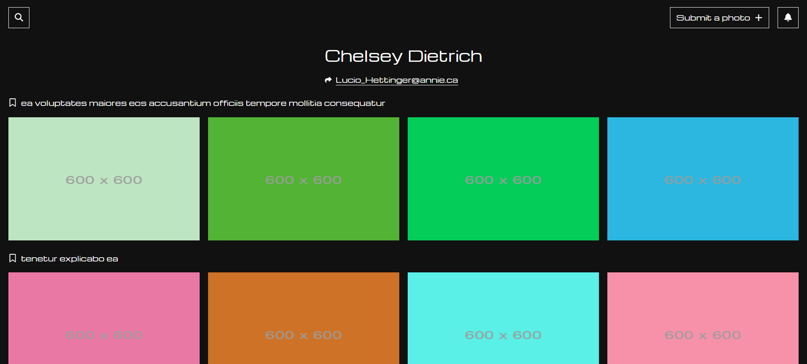

# photo-album


## 介紹
串連 JSONPlaceholder 的個人相簿網站，使用者可依相簿分類進行瀏覽。

### 功能
+ 用戶可透過 JSONPlaceholder 的 userId 登入
+ 查看該用戶所有相簿
+ 查看相簿內容
+ 查看單一相片資訊

## 部署流程
本專案採用 NEXT.js 開發，以 Vercel 進行部署。
選擇 Vercel 除了它本來就是開發 NEXT.js 的公司，更重要的是能夠跟 Github 連動，且具有 CI(持續整合)/CD(持續部署) 的特性，以小型專案而言，在開始前優先部署可避免掉許多因環境、版本所產生的問題。

1. 請確認本地端已安裝 Node.js 和 npm 及其他相關指令或環境設定
2. 在本地端新增資料夾並以編輯器開啟，透過 CLI 工具快速建置 NEXT.js 專案
```
npx create-next-app@latest
```
3. 將專案推送至 Github
4. 進入 Vercel 網站並透過 GitHub 登入
5. 選擇 Add New Project
6. import 目標 repository 並進行相關設定，完成後直接點選 Deploy
7. 等待結果

## 啟用專案
1. 請確認本地端已安裝 Node.js 和 npm
2. 將此專案clone到本地端
3. 安裝相關套件
```
npm install
```
4. 運行專案
```
npm start
```
